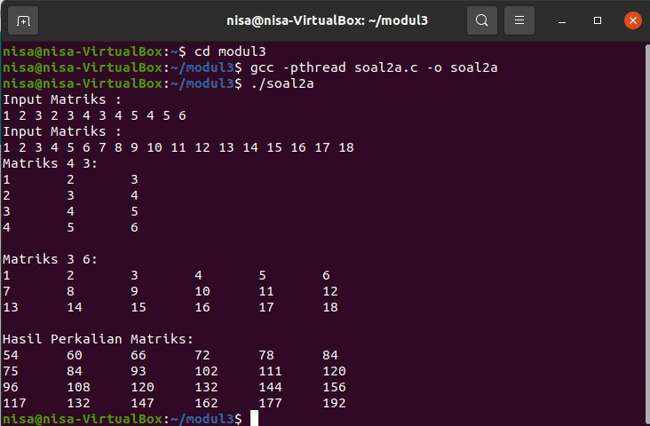
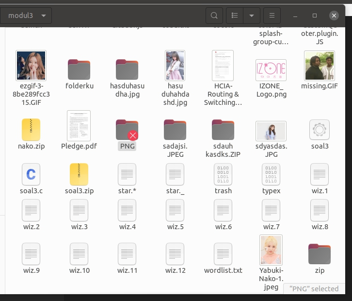
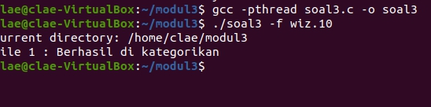
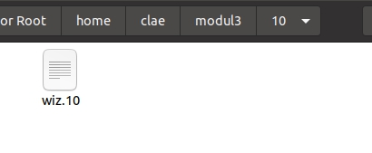
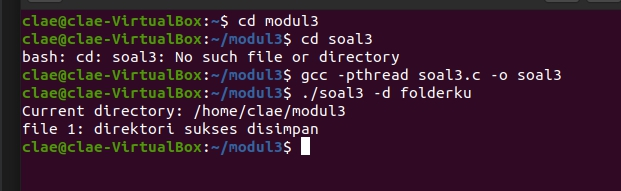
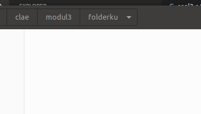
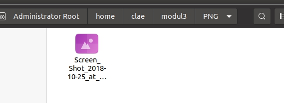
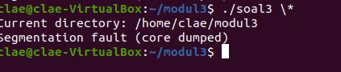
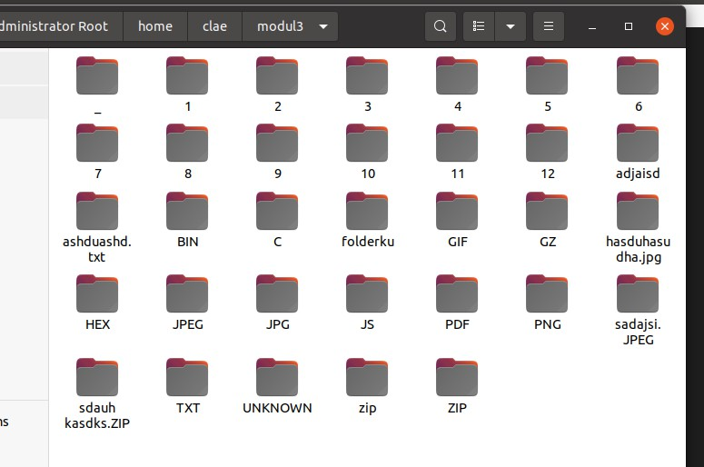

# soal-shift-sisop-modul-3-IT11-2021

# Penjelasan dan Penyelesaian Soal Shift Modul 3 Sistem Operasi
<p> berikut ini merupakan repository resmi untuk laporan soal shift.</p>

## Disusun oleh :
1. Clarissa Fatimah (05311940000012)
2. Revina Rahmanisa (05311940000046)
3. Ghimnastiar AL Abiyyuna (05311940000042)

# Daftar Isi
## Daftar Isi 
* [Soal 1](#soal-1) 
  * [Penyelesaian.](#penyelesaian-soal-1) 
  * [Output.](#output-soal-1) 
  * [Kendala.](#Kendala-Soal-1) 
* [Soal 2](#soal-2) 
   * [Penyelesaian.](#penyelesaian-soal-2) 
  * [Output.](#output-soal-2) 
  * [Kendala.](#Kendala-Soal-2) 
* [Soal 3](#soal-3) 
  * [Penyelesaian.](#penyelesaian-soal-3) 
  * [Output.](#output-soal-3) 
  * [Kendala.](#Kendala-Soal-3) 

# Soal-1

Keverk adalah orang yang cukup ambisius dan terkenal di angkatannya. Sebelum dia menjadi ketua departemen di HMTC, dia pernah mengerjakan suatu proyek dimana keverk tersebut meminta untuk membuat server database buku. Proyek ini diminta agar dapat digunakan oleh pemilik aplikasi dan diharapkan bantuannya dari pengguna aplikasi ini. 

Di dalam proyek itu, Keverk diminta: 

**1 A**

Pada saat client tersambung dengan server, terdapat dua pilihan pertama, yaitu register dan login. Jika memilih register, client akan diminta input id dan passwordnya untuk dikirimkan ke server. User juga dapat melakukan login. Login berhasil jika id dan password yang dikirim dari aplikasi client sesuai dengan list akun yang ada didalam aplikasi server. Sistem ini juga dapat menerima multi-connections. Koneksi terhitung ketika aplikasi client tersambung dengan server. Jika terdapat 2 koneksi atau lebih maka harus menunggu sampai client pertama keluar untuk bisa melakukan login dan mengakses aplikasinya. Keverk menginginkan lokasi penyimpanan id dan password pada file bernama akun.txt dengan format :

id:password

id2:password2

**1 B**

Sistem memiliki sebuah database yang bernama files.tsv. Isi dari files.tsv ini adalah path file saat berada di server, publisher, dan tahun publikasi. Setiap penambahan dan penghapusan file pada folder file yang bernama FILES pada server akan memengaruhi isi dari files.tsv. Folder FILES otomatis dibuat saat server dijalankan.

**1 C**

Tidak hanya itu, Keverk juga diminta membuat fitur agar client dapat menambah file baru ke dalam server. Direktori FILES memiliki struktur direktori di bawah ini : 

``Direktori FILES 
File1.ekstensi
File2.ekstensi``


Pertama client mengirimkan input ke server dengan struktur sebagai berikut :
		Contoh Command Client :
		
add


			
``
Output Client Console:
		
Publisher:
Tahun Publikasi:
Filepath:
``

Kemudian, dari aplikasi client akan dimasukan data buku tersebut (perlu diingat bahwa Filepath ini merupakan path file yang akan dikirim ke server). Lalu client nanti akan melakukan pengiriman file ke aplikasi server dengan menggunakan socket. Ketika file diterima di server, maka row dari files.tsv akan bertambah sesuai dengan data terbaru yang ditambahkan.

# penyelesaian-soal-1

# Output-Soal-1
`` empty ``
# Kendala-Soal-1
Masih awam dengan socket programming pada OS Linux menggunakan Bahasa C

# Soal 2
Crypto (kamu) adalah teman Loba. Suatu pagi, Crypto melihat Loba yang sedang kewalahan mengerjakan tugas dari bosnya. Karena Crypto adalah orang yang sangat menyukai tantangan, dia ingin membantu Loba mengerjakan tugasnya. Detil dari tugas tersebut adalah:

**a.**
Membuat program perkalian matrix (4x3 dengan 3x6) dan menampilkan hasilnya. Matriks nantinya akan berisi angka 1-20 (tidak perlu dibuat filter angka).

**b.**
Membuat program dengan menggunakan matriks output dari program sebelumnya (program soal2a.c) (Catatan!: gunakan shared memory). Kemudian matriks tersebut akan dilakukan perhitungan dengan matrix baru (input user) sebagai berikut contoh perhitungan untuk matriks yang a da. Perhitungannya adalah setiap cel yang berasal dari matriks A menjadi angka untuk faktorial, lalu cel dari matriks B menjadi batas maksimal faktorialnya matri(dari paling besar ke paling kecil) (Catatan!: gunakan thread untuk perhitungan di setiap cel). Ketentuan 
```
If a >= b  -> a!/(a-b)!
If b > a -> a!
If 0 -> 0
```
## Penyelesaian Soal 2
```c
#include <stdlib.h>
#include <stdio.h>
#include <sys/ipc.h>
#include <sys/shm.h>
#include <unistd.h>
```
Import Library
```c
long matriks1[4][3], matriks2[3][6]; 

void scanning(int baris, int column, long matriks[baris][column]) 
{
    printf("Input Matriks : \n");
    int i;
    int j;
    for (i = 0; i < baris; i++) {
        for (j = 0; j < column; j++) {
            scanf("%ld", &matriks[i][j]);
        
        }
    }
}
```
Mengambil Input Matriks

```c
void printMatriks(int baris, int column, long matriks[baris][column]) 
{
    printf("Matriks %d %d:\n",baris, column);
    int i;
    int j;
    for (i = 0; i < baris; i++) {
        for (j = 0; j < column; j++) {
            printf("%ld\t", matriks[i][j]);
        }
        printf("\n");
    }
}
```
Print Matriks
```c
void main() {
    key_t key = 2468; 
    long *hasil;
    int shmid = shmget(key, sizeof(int), IPC_CREAT | 0666);
    hasil = shmat(shmid, NULL, 0);

    scanning(4,3,matriks1);
    scanning(3,6,matriks2);
```
Pembuatan key untuk penyelesaian soal berikutnya
```c
long jumlah = 0;

    int i;
    int j;
    int k;
    for (i = 0; i < 4; i++) { 
        for (j = 0; j < 6; j++) {
            for (k = 0; k < 3; k++) {
            jumlah = jumlah + matriks1[i][k] * matriks2[k][j];
            }
            *(hasil + 6*i + j) = jumlah;
            jumlah = 0;
        }
    }

    printMatriks(4,3,matriks1);
    printf("\n");

    printMatriks(3,6,matriks2);
    printf("\n");
```
Perkalian Matriks       
```c
  printf("Hasil Perkalian Matriks:\n");
    for (int i = 0; i < 4; i++) { 
        for (int j = 0; j < 6; j++) {
            printf("%ld\t", *(hasil + 6*i + j));
        }
        printf("\n");
    }

    sleep(10);

    shmdt(hasil);
}
```
Menampilkan hasil perkalian matriks

## Output soal 2
#### output


## Kendala soal 2
belum bisa menyelesaikan opsi b dan c

# Soal 3
Seorang mahasiswa bernama Alex sedang mengalami masa gabut. Di saat masa gabutnya, ia memikirkan untuk merapikan sejumlah file yang ada di laptopnya. Karena jumlah filenya terlalu banyak, Alex meminta saran ke Ayub. Ayub menyarankan untuk membuat sebuah program C agar file-file dapat dikategorikan. Program ini akan memindahkan file sesuai ekstensinya ke dalam folder sesuai ekstensinya yang folder hasilnya terdapat di working directory ketika program kategori tersebut dijalankan.


Contoh apabila program dijalankan:

```
# Program soal3 terletak di /home/izone/soal3
$ ./soal3 -f path/to/file1.jpg path/to/file2.c path/to/file3.zip
#Hasilnya adalah sebagai berikut
/home/izone
|-jpg
    |--file1.jpg
|-c
    |--file2.c
|-zip
    |--file3.zip

```
**A.**
Program menerima opsi -f seperti contoh di atas, jadi pengguna bisa menambahkan argumen file yang bisa dikategorikan sebanyak yang diinginkan oleh pengguna. 
Output yang dikeluarkan adalah seperti ini :
```
File 1 : Berhasil Dikategorikan (jika berhasil)
File 2 : Sad, gagal :( (jika gagal)
File 3 : Berhasil Dikategorikan
```
**B.**
Program juga dapat menerima opsi -d untuk melakukan pengkategorian pada suatu directory. Namun pada opsi -d ini, user hanya bisa memasukkan input 1 directory saja, tidak seperti file yang bebas menginput file sebanyak mungkin. Contohnya adalah seperti ini:
```
$ ./soal3 -d /path/to/directory/
```
Perintah di atas akan mengkategorikan file di /path/to/directory, lalu hasilnya akan disimpan di working directory dimana program C tersebut berjalan (hasil kategori filenya bukan di /path/to/directory).
Output yang dikeluarkan adalah seperti ini :
```
Jika berhasil, print “Direktori sukses disimpan!”
Jika gagal, print “Yah, gagal disimpan :(“
```
**C.**
Selain menerima opsi-opsi di atas, program ini menerima opsi *, contohnya ada di bawah ini:
```
$ ./soal3 \*
```
Opsi ini akan mengkategorikan seluruh file yang ada di working directory ketika menjalankan program C tersebut.

**D.** 
Semua file harus berada di dalam folder, jika terdapat file yang tidak memiliki ekstensi, file disimpan dalam folder “Unknown”. Jika file hidden, masuk folder “Hidden”.

**E.**
 Setiap 1 file yang dikategorikan dioperasikan oleh 1 thread agar bisa berjalan secara paralel sehingga proses kategori bisa berjalan lebih cepat.

Namun karena Ayub adalah orang yang hanya bisa memberi ide saja, tidak mau bantuin buat bikin programnya, Ayub meminta bantuanmu untuk membuatkan programnya. Bantulah agar program dapat berjalan!

Catatan: 
- Kategori folder tidak dibuat secara manual, harus melalui program C
- Program ini tidak case sensitive. Contoh: JPG dan jpg adalah sama
- Jika ekstensi lebih dari satu (contoh “.tar.gz”) maka akan masuk ke folder dengan titik terdepan (contoh “tar.gz”)
- Dilarang juga menggunakan fork-exec dan system()
- Bagian b dan c berlaku rekursif

## Penyelesaian-soal-3

```c
#include <stdio.h>
#include <stdlib.h>
#include <sys/types.h>
#include <sys/stat.h>
#include <dirent.h> //format of directory entries
#include <string.h>
#include <pthread.h>
#include <unistd.h>
#include <ctype.h> //define toupper case
#include <stdbool.h>
#define _GNU_SOURCE  //untuk mendapatkan fungsi DT_DIR dan DT_REG
#define MAX 10000
```
deklarasi library yang digunakan, terdapat dirent.h untuk mendapatkan format direktori yang dibutuhkan, ctype.h untuk mendefinisikan toupper untuk case senditivem dan GNU Source untuk library pada extension linux

```c
bool x = true; //definisi variable untuk keberhasilan direktori
char workdir[MAX], *fullpath[MAX]; //workdir untuk menampung current work directory
pthread_t tid[3]; //thread sejumlah argumen yaitu 3
```
mendefinisikan variabel untuk menampung current directory dan mendefince fullpath serta variabel pthread sejumlah argumen yang dibutuhkan yaitu 3.

```c

//menjadikan semua variable uppercase
char *uppercase(char *huruf) {
        int i=0;
        char kata[30], upper, result[30]; //deklarasi variabel 
        sprintf(kata, "%s", huruf);
        while (kata[i]) {
            upper = kata[i];
            result[i] = toupper(upper);//conver lowercase to uppercase
        i++;
        } 
        char *res =result;
        return res;
}
```
fungsi uppercase digunakan untuk menjadikan semua nama direktori menjadi uppercase agar mencegah case sensitive. selanjutnya menggunakan fungsi toupper yang didapat dari library ctype.h untuk menconvert menjadi uppercase. kemudian result di return res.

```c    
void* directory(void *arg)
{
    char abs1[MAX], *abs2[MAX]; //untuk mengambil nama file dalam absolute path pada directory
    char hasilabs[MAX]; //hasil nama file dan ekstensi dr absolute path
    int pjgpath = 0, pjgeks = 0; //mendeklarasi panjang path dan panjang ekstensi
    char *namapath, *namafile;
    char upcase[MAX];
    char s[5]="/", t[5]= ".";
    //untuk memindah file menuju dirpath yang dituju
    char pindaharg[MAX], pindahdir[MAX];
```
fungsi directory yang digunakan untuk keperluan direktori. dimana pertama tama di deklarasikan dulu masing2 variable yang dipakai. 

```c
    strcpy(abs1,arg);
    namapath = strtok(abs1, s); // untuk memisahkan string yang diparsing dengan karakter
    while(namapath != NULL){
        abs2[pjgpath] = namapath;
        pjgpath++;
        namapath = strtok(NULL, s);
    }
    strcpy(hasilabs,abs2[pjgpath-1]);
```
 untuk mendapatkan fie dari panjang path yang diambil. dilakukan strcpy pada absolute path, kemudian diambil nama path direktori keseluruhan. di loop sesuai permintaan. kemudian di copy ke salah hasil absolute path dg  ```strcpy``` pada ```hasilabs```


 ```c
    namafile = strtok(abs2[pjgpath-1],t);
    while(namafile !=  NULL){
        fullpath[pjgeks] = namafile;
        pjgeks++;
        namafile = strtok(NULL, t);
    }
```
setelah mendapatkan path directorynya kemudian diambil ekstensi file. 

```c
    strcpy(upcase,fullpath[pjgeks-1]);
    char *hasilupcase = uppercase(upcase);
```
 mengecek setiap huruf dr fullpath 

 ```c
  //dirrent.h
    DIR *d; //type data directory stream 
    struct dirent *dir;  //return information about directory entries
    d = opendir(workdir); //membuka current working directory
    char fullpath[MAX];
    int check = 0;
 ```
 disinilah kami mereturn informasi dari directory stream dengan bantuan ```opendir``` akan membuka current working directory.

 ```c
    if(pjgeks > 1){
        if(dir){
            while((dir = readdir(d)) != NULL){ //membcaca directory yang masuk
                if(strcmp(dir->d_name, hasilupcase) == 0 && dir->d_type == DT_DIR){ //d_type directory entry type
                    check = 1; //d_name point to string that gives the name of directory
                    break;
                }
            }
        }
        //jika belum, buat directory
        if(check == 0){
            strcpy(fullpath,workdir);
            strcat(fullpath,"/");
            strcat(fullpath,hasilupcase);
            mkdir(fullpath, 0333);
        } 
        }
 ```

 disini dilakukan pengecekan apakah ada direktori yang bernama ektensi file sebelumnya. jika ada maka akan lanjut. jika tidak ada maka akan membuat direcotry baru dg ```mkdir``` dg format write dan execute.

 ```c
    else{
        strcpy(fullpath,workdir);
        strcat(fullpath,"/");
        strcat(fullpath,"UNKNOWN");
        mkdir(fullpath, 0333);
        }
 ```
 jika file tidak ada dan tidak mengandung ektensi maka buat folder unknown. dengan format yang sama.

 ```c
 // untuk memnidahkan file menuju path yang dituju
    strcpy(pindaharg,arg);
    strcpy(pindahdir,workdir);
    strcat(pindahdir,"/"); 
    if(pjgeks == 1){
        strcat(pindahdir,"UNKNOWN");
    }else{
        strcat(pindahdir,hasilupcase);
    }
    strcat(pindahdir,"/");
    strcat(pindahdir,hasilabs); //memasukkan nama file dari hasil absolute path ke direktori baru yyang dibuat
    if (rename(pindaharg,pindahdir)<0){ // di rename sesuai ekstensi
        x= false; 
    }
    pjgeks = 0; 
    pjgpath = 0;
 ```
 jika folder sudah ada maka langsung dipindah, kemudian dilakukan looping apakah tidak memiliki ekstensi atau memiliki ekstensi. selanjutnya di rename hasil yang didapat sesuai ekstensi. jika gagal maka akan false. kemudian panjang ekstensi dan panjang path direset ke nol lagi agar bisa digunakan kembali

 ```c
int main(int argc, char *argv[]) {
    DIR *d;
    struct dirent *dir;
    char dirpath[300];
    if(getcwd(workdir, sizeof(workdir)) != NULL) { 
    printf("Current directory: %s\n", workdir);
    }
        if (strcmp(argv[1],"-f") == 0) {
            int i=0;
            for(int j = 2 ; j < argc ; j++ ){
                pthread_create(&(tid[i]),NULL,directory,argv[j]); 
                pthread_join(tid[i],NULL);
                if (x){
                    printf("file %d : Berhasil di kategorikan\n",j-1);
                } else{
                    printf("file %d : sad gagal\n",j-1);
                    }
                i++;
            }
        }
 ```
 pada int main, mengambil current working directori dengan bantuan getcwd. selanjutnya diprint. untuk masing masing opsi dilanjutkan kedalam if condition. jika -f maka akan menjalankan pthreadnya sesuai nama file. 

 ```c
         else if(strcmp(argv[1],"*") == 0){
            d = opendir(workdir);
            if(d){
                while((dir = readdir(d)) != NULL){
                    if ((strcmp(dir->d_name, ".") == 0) || (strcmp(dir->d_name, "..") == 0) ) //skip . dan ..
                        continue;
                    strcpy(dirpath,workdir);
                    strcat(dirpath,"/");
                    strcat(dirpath,dir->d_name);
                    int i  = 0;
                    if(dir->d_type == DT_REG){ //reguler file
                        pthread_create(&(tid[i]),NULL,directory,dirpath); 
                        pthread_join(tid[i],NULL);
                        i++;
                    }
                }

            }
        }
 ```
 jika opsi \* maka akan mengambil seluruh workdir dan memproses pthread.
```c
    else(strcmp(argv[1], "-d") == 0); {
                d = opendir(argv[2]);
                if(d){
                    while ((dir = readdir(d)) != NULL){
                            if ((strcmp(dir->d_name, ".") == 0) || (strcmp(dir->d_name, "..") == 0) )
                                continue;
                            strcpy(dirpath,argv[2]);
                            strcat(dirpath,"/");
                            strcat(dirpath,dir->d_name);
                            int i = 0;
                            bool x = true;
                            if(dir->d_type == DT_REG){ //directory entries for reg files
                                pthread_create(&(tid[i]),NULL,directory,dirpath); 
                                pthread_join(tid[i],NULL);
                                    if (x){
                                        printf("file %d : direktori sukses disimpan\n",i+1);
                                    } else{
                                        printf("file %d : sad gagal\n",i+1);
                                        }
                                i++;
                        }
                    }
                }
            }

    return 0; 
}
``` 
terakhir untuk opsi -d maka akan mengambil directory yang dipilih saja dengan argv[2]

## Output soal 3
### opsi -f

#### input 

#### output


### opsi -d
#### input

#### output
<p> akan kosong dan masuk ke folder sesuai ekstensi </P>



<p> masuk ke folder sesuai ekstensi</p>



### opsi *
#### input 

#### output


## Kendala Soal 3
1. kendala yang pada pengaksesan memori yang tidak diinginkan sehingga menyebabkan segmentation fault pada opsi *